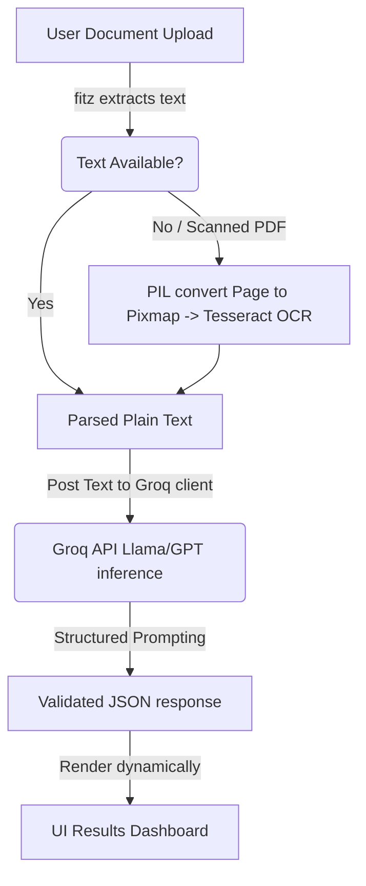

# Resufit - AI-Powered Resume Builder & Analyzer

Resufit is an advanced, full-stack web application designed to bridge the gap between job candidates and modern Applicant Tracking Systems (ATS). Using state-of-the-art Large Language Models (LLMs) and advanced document parsers, Resufit analyzes resumes, computes real-time ATS match scores, tailors content to target job descriptions, and includes an interactive section-by-section resume builder with professional template exports.

---

## Features

### 🔍 Deep Resume Analysis & Parsing
- **Document Text Extraction**: Extract text from standard searchable PDFs via `PyMuPDF`.
- **Hybrid OCR Engine**: Automatic fallback to `Tesseract OCR` for scanned PDF pages and images (PNG, JPG).
- **AI Details Parser**: Extracts candidate info, target job titles, summaries, skills, work history, education, projects, and certifications.
- **ATS Report Card**: Calculates real-time scores, parses missing fields, highlights strengths, flags weaknesses, and lists concrete improvements.

### 💼 Target Job Fit Analysis
- **Keyword Matcher**: Compares target resumes with pasted job descriptions to identify matches and locate missing critical technical terms.
- **Compatibility Score**: Calculates a percentage-based relevance rating.
- **Tailoring Suggestions**: Suggests specific industry certifications and offers targeted advice to elevate the match rating above 90%.
- **Actionable Suggestions**: Provides custom recommendations based on missing skills.

### 🛠️ Interactive Resume Builder
- **Step-by-Step Wizard**: Form-based wizard dividing sections logically (Header, Summary, Experience, Education, Skills, Projects, Languages, Certifications).
- **AI Text Enhancer**: Enhances bullet points or summaries directly within the form using professional, results-oriented, ATS-friendly phrasing.
- **Real-time Preview Pane**: Live preview of the compiled resume draft side-by-side with the editor.
- **JSON Import/Export**: Import previous resumes to resume builder editing or export current progress to a reusable JSON backup.
- **Download PDF**: Style resumes with curated visual templates and download clean, printer-friendly, ATS-compatible PDFs.

### 🎨 Styling & Theming
- **Forced Auth Themes**: Landing page and Auth split screens are set to a clean light theme.
- **Reactive Dark/Light Mode**: Builder workspace and dashboard screens support dark/light theme switching with instant state persistence.
- **Responsive Fluid Layouts**: Fluid layout support for mobile viewports, including wrapped navbar rows, icon-only mobile buttons, collapsible navigation drawers, and stacked grids.

### 🔐 Secure Authentication
- Standard credentials email/password registration and sign-in.
- Fully integrated Google OAuth login.

---

## Tech Stack

### Backend
- **Core Framework**: Python 3 & Flask
- **Database**: SQLite3 (relational local storage)
- **Sessions & Storage**: Flask Sessions (persisted in server-side local memory / cookies)

### AI & Text Extraction
- **Inference Engine**: Groq SDK client
- **AI Models**: `llama-3.3-70b-versatile` (job fit, keyword extraction, tailoring) and `openai/gpt-oss-120b` (resume parsing)
- **PDF Extraction**: `PyMuPDF` (aka `fitz`)
- **OCR Engine**: `Tesseract OCR` (using `pytesseract` bindings)
- **Image Processing**: Pillow (`PIL`)

### Frontend
- **Structure & Logic**: HTML5, Vanilla JavaScript
- **Styles**: Custom CSS3 utilizing CSS custom properties, HSL color palettes, Glassmorphism panels, and smooth micro-animations.
- **Icons**: FontAwesome 6

---

## Project Directory Structure

```text
Resufit/
│
├── app.py                 # Core Flask application (routes, auth, database integration)
├── ocr.py                 # PDF/Image text extraction & Tesseract OCR fallbacks
├── groq_ai.py             # LLM prompt templates and Groq API client integration
├── database.db            # SQLite database file (auto-generated on launch)
│
├── static/                # Static assets & stylesheets
│   ├── auth_split.css     # Form layouts for authentication split pages
│   ├── style.css          # Landing page, layout grids, components, and modal styles
│   └── resufit.css        # Shared variables & utility styles
│
├── templates/             # HTML Templates
│   ├── index.html         # Landing page (Sign-in modal included)
│   ├── home.html          # Dashboard (Resume Analysis, Job Fit tabs)
│   ├── builder.html       # Interactive resume editor (Form wizard & live preview)
│   ├── signin.html        # Split screen authentication (Sign In)
│   ├── signup.html        # Split screen authentication (Sign Up)
│   ├── forgot-password.html# Forgot password flow (Email input)
│   ├── verify.html        # OTP Verification input screen
│   └── new-pass.html      # Create new password input screen
│
├── uploads/               # Target folder for uploaded resume files
├── requirements.txt       # Python package dependencies
└── README.md              # Project documentation
```

---

## Installation & Setup

### Prerequisites
1. **Python 3.8+**: Ensure Python is installed on your local machine.
2. **Tesseract OCR**:
   - **Windows**: Download and run the installer from [UB-Mannheim Tesseract](https://github.com/UB-Mannheim/tesseract/wiki). By default, install to `C:\Program Files\Tesseract-OCR\tesseract.exe`.
   - **macOS**: Install via Homebrew: `brew install tesseract`.
   - **Linux**: Install via apt: `sudo apt install tesseract-ocr`.

### Local Setup
1. **Clone the repository**:
   ```bash
   git clone https://github.com/username/Resufit.git
   cd Resufit
   ```

2. **Create a Virtual Environment**:
   ```bash
   python -m venv env
   source env/bin/activate  # On Windows: env\Scripts\activate
   ```

3. **Install Dependencies**:
   ```bash
   pip install -r requirements.txt
   ```

4. **Environment Variables**:
   Create a `.env` file in the root directory and configure the following parameters:
   ```env
   PORT=5000
   secret_key=your_random_flask_secret_key
   groq_api_key=your_groq_sdk_api_key
   redirect_uri=http://127.0.0.1:5000/google-callback  # Set up if using Google OAuth
   ```

5. **Start the Application**:
   Run the Flask server:
   ```bash
   python app.py
   ```
   Open `http://127.0.0.1:5000` in your web browser.

---

## How to Use Guide

### 1. Document Parsing & ATS Scoring
1. Sign up or log in.
2. On the **Resume Hub** dashboard, drag and drop or click to upload your resume (PDF/Image formats).
3. The dashboard will show a loader and display a detailed ATS breakdown:
   - Overall Score.
   - Identified candidate info and tech stack.
   - List of missing fields (e.g. GitHub URL, phone).
   - Actionable recommendations to improve bullet points.

### 2. Job Match Analysis
1. Switch to the **Job Fit Analysis** tab on your dashboard.
2. Paste the target job description text in the provided field.
3. Upload your resume and click **Start Job Match Analysis**.
4. The screen will display matching keywords, critical missing requirements, and recommended certifications with concrete rationale.

### 3. Builder Wizard & Live Styling
1. Select the **Resume Builder** tab, and click **Create new resume**.
2. Complete each step (Header, Summary, Experience, etc.) in the wizard.
3. Use the **Optimize with AI** button next to description inputs to polish bullet points automatically.
4. Toggle templates (e.g. Tech Specialist, Academic CV, Modern Corporate) using the top navbar selector dropdown to update the live preview layout instantly.
5. Save your progress using the **Export JSON** option, or import a draft back with **Import JSON**.
6. Print your final resume or download it as an ATS-compatible PDF using the **Save PDF** action button.

---

## Live Application Link
Access the production application live here:
👉 **[Live Application Link](https://resufit-example.ngrok-free.dev)** *(Placeholder: Update with actual live deployment URI)*

---

## Live Demo Walkthrough Guide
Try the following flow to evaluate the core pipeline:
1. Navigate to the landing page and click **Get Started Now** to access the Sign-in modal.
2. Click **Create Account** to navigate to `/signup` and fill out your email and password.
3. After registration, upload the provided sample resume in the dashboard panel.
4. Review the extracted skills list and recommendations.
5. Click the **Job Fit Analysis** tab, paste a backend engineer job description, upload the same resume, and press match. Notice the keyword overlap.
6. Open the **Resume Builder**, click **Create new resume**, select **Silicon Valley Technical** template, enter your details, and press **Save PDF** to download your tailored file.

---

## Technical Architecture & Details

### Pipeline Visualizer


### Database Schema
- **users** Table:
  - `id` (INTEGER, Primary Key, Auto-increment)
  - `email` (TEXT, Unique, Not Null)
  - `password` (TEXT, Nullable for OAuth accounts)
  - `provider` (TEXT, 'credentials' | 'google')
- **uploads** Table:
  - `id` (INTEGER, Primary Key, Auto-increment)
  - `file_path` (TEXT)
  - `uploaded_at` (TIMESTAMP)

---

## Troubleshooting Guide

### 1. `TesseractNotFoundError`
- **Symptom**: Terminal throws `pytesseract.pytesseract.TesseractNotFoundError`.
- **Solution**: Install Tesseract OCR on your system. If installed in a custom directory, update the path string at the top of `ocr.py`:
  ```python
  pytesseract.pytesseract.tesseract_cmd = r"/path/to/your/tesseract"
  ```

### 2. `Invalid API Key` or `Authentication Exception`
- **Symptom**: Resume analysis loader spins infinitely or returns errors.
- **Solution**: Ensure your `.env` file is in the root directory (same folder as `app.py`) and contains a valid `groq_api_key`. Restart the Flask server after modifying `.env`.

### 3. Blank Live Preview on Resume Builder
- **Symptom**: The right-side preview pane in `/builder` does not render.
- **Solution**: Make sure JavaScript is enabled in your browser. Open browser developer tools (F12) and inspect the console logs for template loading or schema errors.

---

## License
Distributed under the **MIT License**. See `LICENSE` for more information.

---

## Acknowledgements
- [Groq SDK Developers](https://groq.com/)
- [PyMuPDF (fitz) Community](https://github.com/pymupdf/PyMuPDF)
- [Pytesseract wrapper](https://github.com/madmaze/pytesseract)
- [FontAwesome Icons](https://fontawesome.com/)
